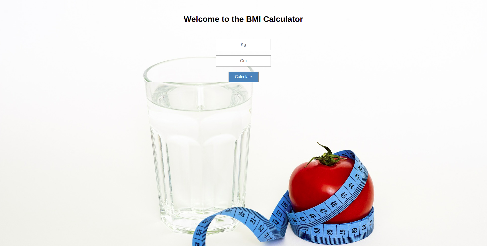

# The BMI Calculator
**week 3 of learning how to code.** Building a basic BMI-calculator that lets you know if you are normal, over- or underweight. Testing functions with Cypress and launching with GitHub. [Try out the BMI-calculator for yourself!](https://kfrostare.github.io/BMI_repo/)

*More information below the image.*

### Assignment
**Make sure the user can:**
* Enter weight
* Enter height
* Press calculate- button
* View a message

### Programs practiced in this challenge
* **Coding**
: | JavaScript | Html | Css |
* **Testing**
: | Cypress | Yarn |  
* **Launching**
: | GitHub |
* **Other**
: | VSCode | Git |

## Build, test and launch
* Built with the source-code editor [Visual Studio Code](https://code.visualstudio.com/)
* Tested with [Cypress](https://www.cypress.io/); the Js End to End testing framework
* Launched using [GitHub](https://github.com/); the world's leading software development platform

## Authors
* **Karolina Frostare** has built this application
* **[Craft Academy](https://www.craftacademy.se/english/)** has created this challenge and provided the learning material needed to accept it

## Acknowledgments
* The image used was (royalty) free and provided by [Pixabay.com](https://pixabay.com/)
* This assignment was provided by [Craft Academy](https://www.craftacademy.se/english/)
